<div align="center">

# Athena

**A cross-distro GUI package manager built with Qt6.**

Manage your system's native packages (DNF, APT, or Pacman), plus Flatpak and Snap apps, all from one window.

[](LICENSE)
[](https://github.com/niruxx/Athena/actions/workflows/c-cpp.yml)


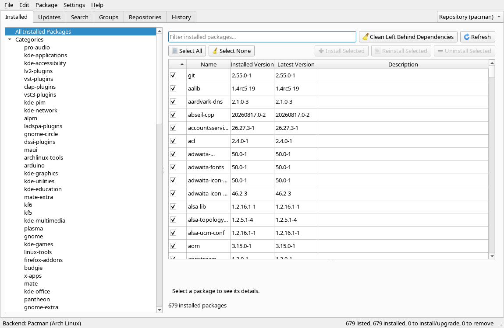

</div>

## Contents

- [Features](#features)
- [See it in action](#see-it-in-action)
- [Screenshots](#screenshots)
- [Supported systems](#supported-systems)
- [Installing](#installing)
- [Building from source](#building-from-source)
- [A note on privileges](#a-note-on-privileges)
- [Changelog](#changelog)
- [License](#license)

## Features

- 🖥️ **One app, every major distro** — automatically detects and drives DNF (Fedora/RHEL), APT (Debian/Ubuntu), or Pacman (Arch), plus Flatpak and Snap, side by side in the same window.
- ☑️ **Checkbox multi-select, Synaptic-style** — tick packages across a filtered list and install, reinstall, or uninstall them in a single batch.
- 🔍 **See what a change actually does before it happens** — install/uninstall confirmations show the real, dependency-resolved plan (what gets pulled in, what becomes unused and gets cleaned up), not just a name you already know.
- 📟 **Live terminal output** — every install, uninstall, and reinstall runs in a small terminal window showing the exact command and its output as it streams, so failures are never a mystery.
- 🧹 **Uninstall really cleans up** — removing a package also removes the dependencies it pulled in that nothing else needs, and a dedicated "Clean Left Behind Dependencies" button sweeps up anything left over from the past.
- 📂 **Category browser** — browse packages by group/meta-group (comps groups on Fedora, tasksel tasks on Debian, pacman groups on Arch) instead of only searching by name.
- 🌐 **Repository management** — enable/disable repos, add new ones, and refresh package metadata, for your native package manager and Flatpak remotes alike. On DNF, a repo can also be added straight from a **COPR** `owner/project`, alongside plain ID/URL repos.
- 🔒 **Full Flatpak sandbox control** — a dedicated **Permissions** editor (shared namespaces, sockets, devices, sandbox features, filesystem access, D-Bus name policies, environment variables) built on `flatpak override`, plus **User Data** (browse/clear `~/.var/app` per app) and **Leftover Data** (find and remove data left behind by apps uninstalled outside Athena) tabs.
- 💾 **Flatpak Backup & Restore** — back up every Flatpak app's user data and the list of installed apps to a single `.tar.gz`, then restore the data or reinstall the apps on a new machine or after a fresh OS install.
- ⬆️ **Update checking** — a dedicated Updates tab per backend, with one-click "Select All" to batch-upgrade everything at once.
- 🕘 **History** — see recent install/remove/update activity for each backend.
- 👋 **Guided first-run setup** — detects your distro, lets you set theme/startup tab/compact lists/update-checking right there, and offers to install Flatpak/Snap support on the spot if it's missing. Revisit it anytime from **Preferences → Run First-Time Setup Again**.
- ⚙️ **Customizable** — theme (light/dark/system), startup tab, compact list rows, and a full Preferences dialog organized into General, System, Layout, and Logging Options tabs.
- 🔔 **Notifies you about new Athena releases** — checks GitHub on startup (optional) and shows a dismissible banner when a newer version is out.
- 🖲️ **System tray integration** — a tray icon appears when updates are available, with a right-click menu for Settings, Update (installs everything pending in one go), and Quit. Polls on a configurable interval.
- 🔍 **Advanced search** — beyond a plain keyword search: a **Dependency Query** mode finds packages that provide or require a given capability (e.g. a library soname), plus **Repository** and **Architecture** filters to narrow results.
- ⬇️ **Download without installing** — grab a copy of a package (optionally plus its not-yet-installed dependencies) to a folder of your choice, instead of installing it.
- 📏 **Architecture and size columns** — optional columns in every package list (toggle from the table header), and a package's homepage link — when the backend reports one — shown right in its details panel.
- 📝 **Optional file logging** — enable logging to a folder of your choice with a configurable verbosity level, for troubleshooting.

## See it in action

<table>
<tr>
<td width="33%" valign="top">

**Switching backends**

One dropdown moves between your system's package manager and Flatpak/Snap, tab bar and all.

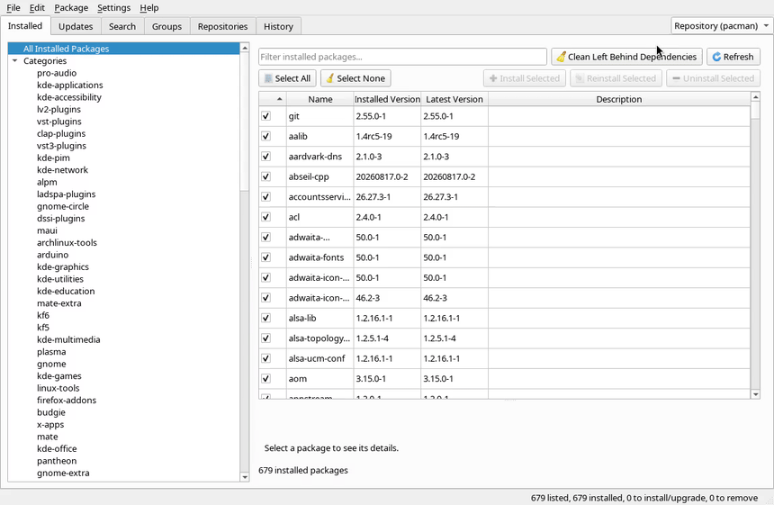

</td>
<td width="33%" valign="top">

**Live sandbox permissions**

Toggle a Flatpak app's sandbox access and it takes effect immediately — no restart, no rebuild.

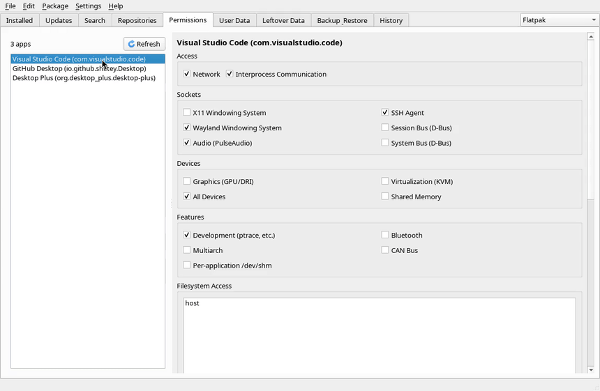

</td>
<td width="33%" valign="top">

**Search as you go**

Type a name, hit enter, and results (with live install status) show up right away.

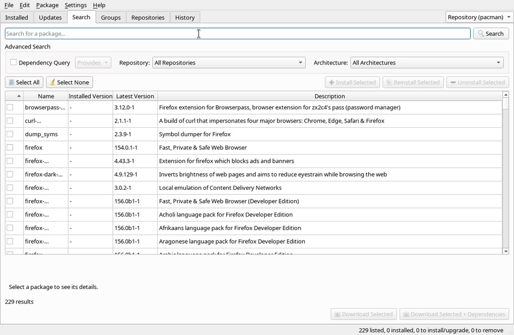

</td>
</tr>
</table>

## Screenshots

<details>
<summary><strong>Category browser</strong> — browse by group instead of searching by name</summary>

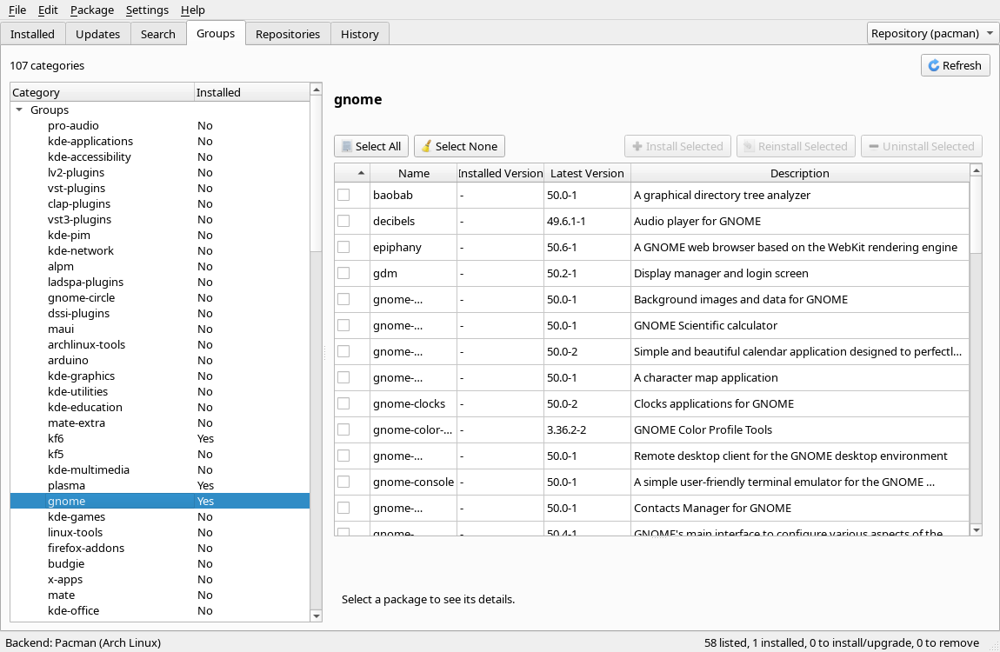

</details>

<details>
<summary><strong>Advanced search</strong> — Dependency Query plus Repository/Architecture filters</summary>

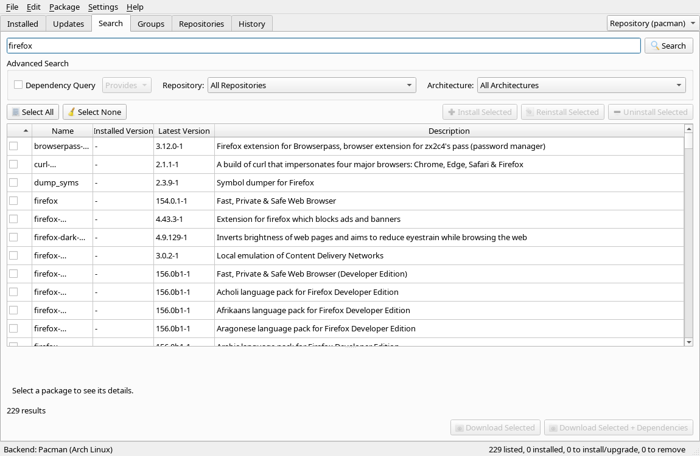

</details>

<details>
<summary><strong>Repository management</strong></summary>

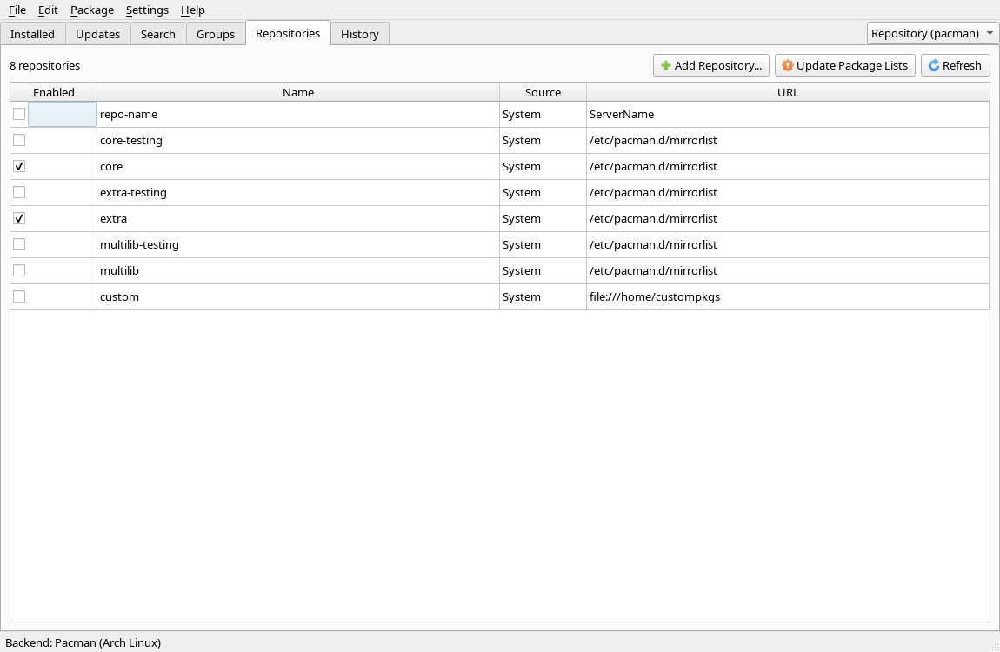

</details>

<details>
<summary><strong>Flatpak Permissions</strong> — the full sandbox editor</summary>

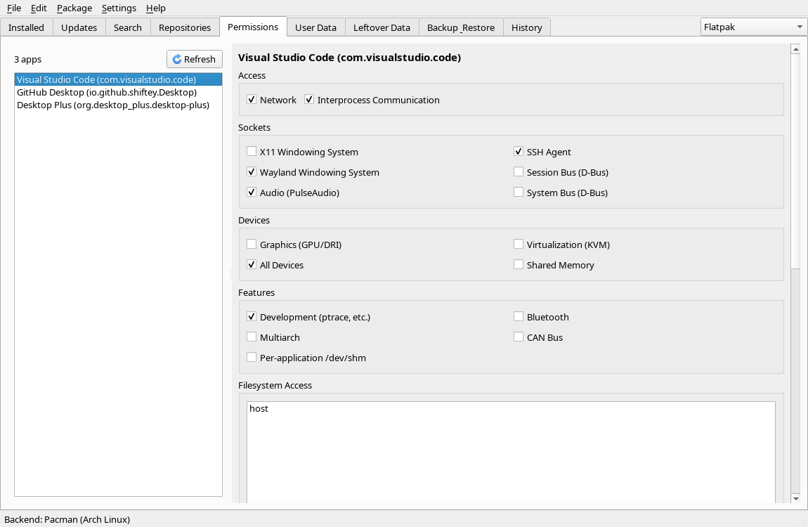

</details>

<details>
<summary><strong>Flatpak User Data</strong> — browse/clear per-app data with size scanning</summary>

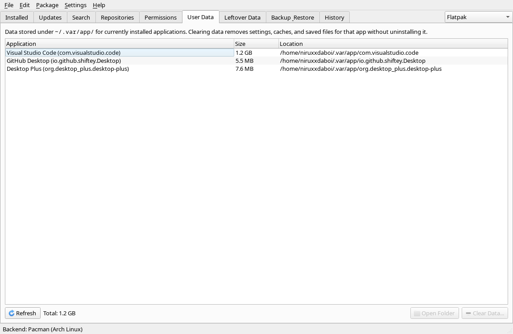

</details>

<details>
<summary><strong>Flatpak Leftover Data</strong> — find data left behind by uninstalled apps</summary>

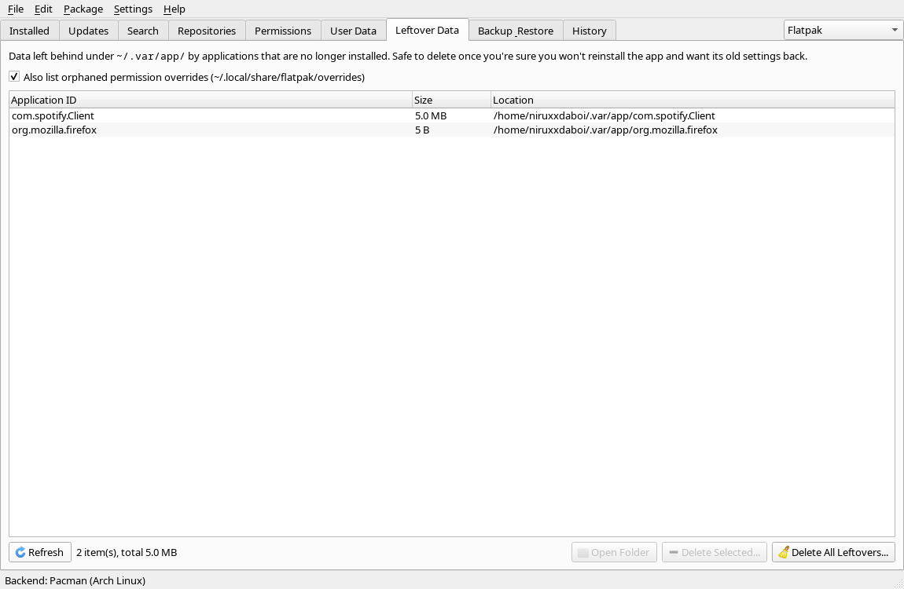

</details>

<details>
<summary><strong>Flatpak Backup &amp; Restore</strong></summary>

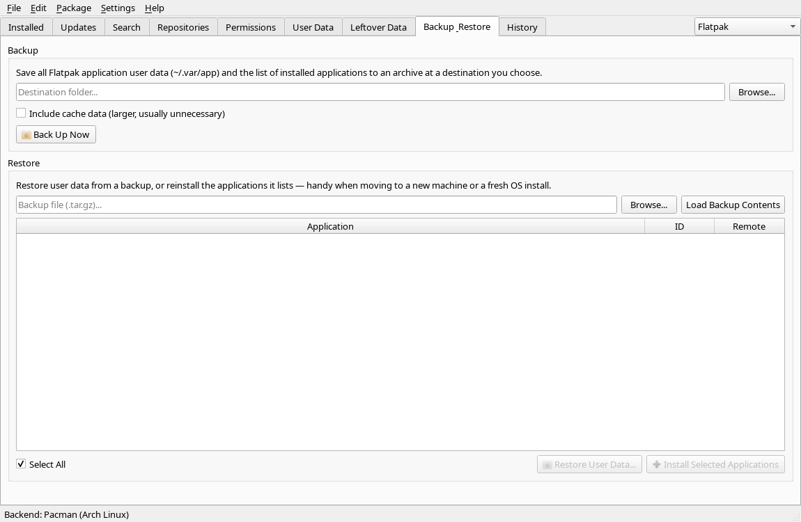

</details>

<details>
<summary><strong>Guided first-run setup</strong></summary>

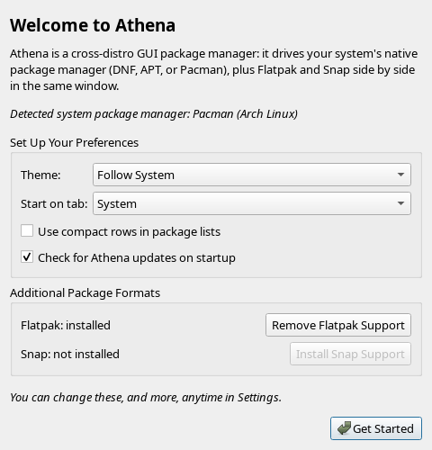

</details>

<details>
<summary><strong>Preferences</strong></summary>

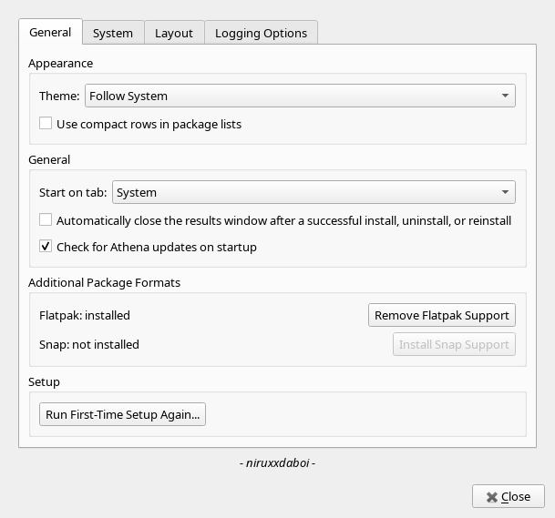

</details>

## Supported systems

| Distro family     | Package manager | Status                             |
| ------------------ | ---------------- | ----------------------------------- |
| Fedora / RHEL       | `dnf5`            | Fully tested                        |
| Debian / Ubuntu     | `apt`             | Implemented, not yet field-tested   |
| Arch Linux          | `pacman`          | Fully tested                        |
| Any of the above    | `flatpak`         | Fully tested                        |
| Any of the above    | `snap`            | Implemented, not yet field-tested   |

## Installing

Prebuilt packages are published on the [GitHub Releases page](https://github.com/niruxx/Athena/releases) for every tagged version:

| Distro                | Format                                    |
| ---------------------- | ------------------------------------------ |
| Fedora / RHEL           | `.rpm`                                     |
| Debian / Ubuntu         | `.deb`                                     |
| Arch Linux              | [`PKGBUILD`](packaging/arch/PKGBUILD)      |
| Any distro (portable)   | `.AppImage` — no install needed, just run it |

Athena will also let you know inside the app when a new version is available — see **Preferences → Check for Athena updates on startup**.

## Building from source

<details>
<summary><strong>Requirements</strong></summary>

- CMake 3.16+
- A C++17 compiler (GCC or Clang)
- Qt6 development packages: **Widgets**, **Concurrent**, and **Network**

On Fedora:

```bash
sudo dnf install cmake gcc-c++ qt6-qtbase-devel
```

On Debian/Ubuntu:

```bash
sudo apt install cmake g++ qt6-base-dev
```

On Arch:

```bash
sudo pacman -S cmake gcc qt6-base
```

</details>

```bash
git clone https://github.com/niruxx/Athena.git
cd Athena
cmake -S . -B build -DCMAKE_BUILD_TYPE=Release
cmake --build build -j$(nproc)
```

The resulting binary is at `build/athena`:

```bash
./build/athena
```

Packaging (`.rpm`/`.deb` via CPack, `.AppImage` via `linuxdeploy`, Arch via `packaging/arch/PKGBUILD`) is what [the CI workflow](.github/workflows/c-cpp.yml) runs on every push and nightly — check there for the exact commands if you want to build a package yourself. Each of Arch, Fedora, and Debian can also be built locally in an isolated container via `packaging/<distro>/build-in-podman.sh` (needs [podman](https://podman.io/)), which is how each format's real package gets built and linked against that distro's own Qt6/glibc without needing a matching host.

## A note on privileges

Installing, removing, and reinstalling packages is done through [`pkexec`](https://www.freedesktop.org/software/polkit/docs/latest/pkexec.1.html) (Polkit), which prompts you for your password through your desktop's native authentication dialog — Athena never asks for or stores a password itself. Flatpak install/remove operations use Flatpak's own built-in Polkit integration the same way; Snap has no such integration of its own, so its operations go through `pkexec` too. Downloading packages (without installing them) is unprivileged on DNF, APT, and Snap; Pacman and Flatpak downloads still go through the same privilege model as a normal install. Flatpak's Permissions, User Data, Leftover Data, and Backup & Restore tabs are the exception in the other direction — they all act on user-level state (`~/.local/share/flatpak/overrides`, `~/.var/app`), so none of them need a privilege prompt at all.

## Changelog

See [CHANGELOG.md](CHANGELOG.md) for a version-by-version history of what's changed.

## License

Athena is licensed under the [GNU General Public License v3.0](LICENSE).
